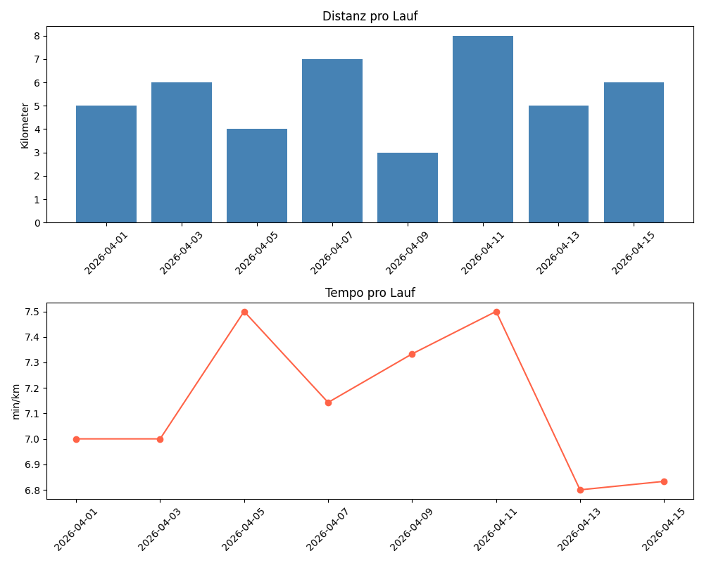

# Lauf-Auswertung mit Python

Ein Python-Projekt zur Analyse und Visualisierung von Laufdaten.
Erstellt als Portfolioprojekt für Bewerbungsunterlagen.

## Was das Projekt macht
- Lädt Laufdaten aus einer CSV-Datei
- Berechnet das Tempo (min/km) für jeden Lauf
- Zeigt eine Zusammenfassung der Statistiken
- Erstellt Diagramme zur Visualisierung
- Speichert Daten in einer SQL-Datenbank
- Beantwortet Fragen per SQL-Abfragen

## Technologien
- Python 3.12
- pandas
- matplotlib
- SQLite (SQL-Datenbank)

## Projektstruktur
laufprojekt/
├── data/
│   ├── raw_runs.csv        # Rohdaten
│   └── runs.db             # SQL-Datenbank
├── src/
│   ├── load_data.py        # Daten laden
│   ├── process_data.py     # Daten verarbeiten & Statistiken
│   ├── visualize.py        # Diagramme erstellen
│   └── database.py         # Datenbank & SQL-Abfragen
├── main.py                 # Hauptprogramm
└── README.md               # Diese Datei

## Ergebnisse
- 8 Läufe analysiert
- 44 km Gesamtdistanz
- Schnellstes Tempo: 6.80 min/km
- Durchschnittstempo: 7.14 min/km

## SQL-Abfragen
```sql
-- Alle Läufe
SELECT * FROM runs

-- Schnellster Lauf
SELECT date, distance_km, pace_min_per_km 
FROM runs 
ORDER BY pace_min_per_km ASC 
LIMIT 1

-- Läufe über 5km
SELECT date, distance_km 
FROM runs 
WHERE distance_km > 5
```

## Diagramme
